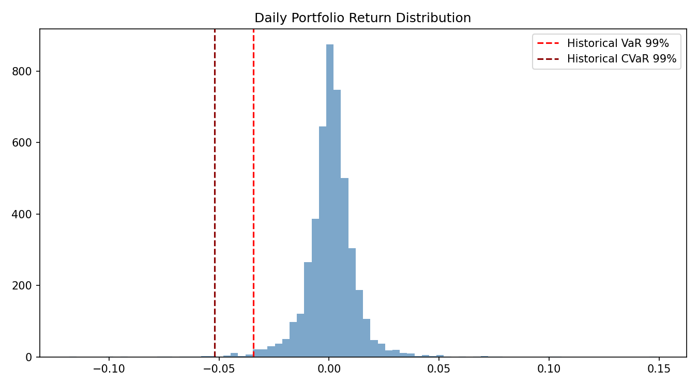
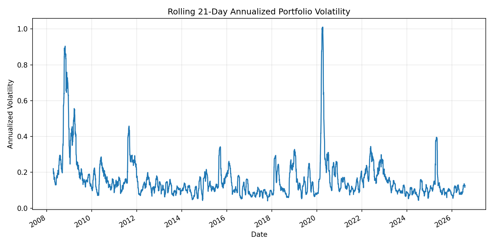
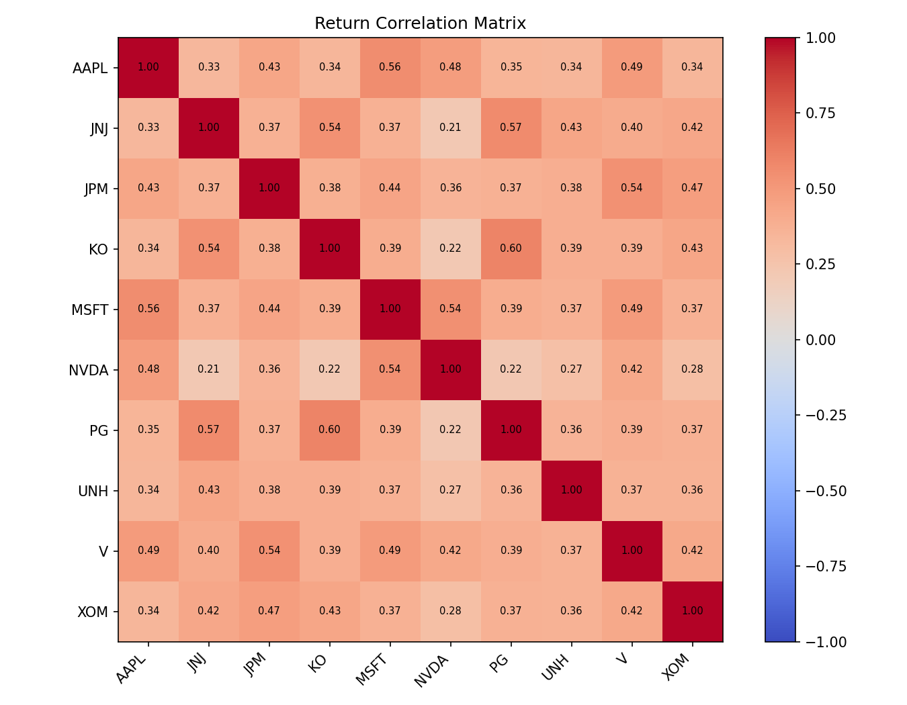

# Risk & Stress Testing Engine

Risk of an equity portfolio in Python: 99% VaR and CVaR with three methods
(historical, parametric, Monte Carlo), stress tests on the 2008, 2020 and 2022
crises, rolling volatility and correlations.

  

## What it does

$10m portfolio, equally weighted on 10 US stocks (AAPL, MSFT, JPM, XOM, JNJ,
PG, V, NVDA, KO, UNH), daily prices 2007 to 2026.

- **One-day 99% VaR and CVaR:** historical simulation, parametric normal
  (variance-covariance), Monte Carlo (20,000 draws).
- **Stress tests:** the returns of each stock over a real crisis window,
  applied to today's weights.
- **Charts:** rolling volatility, return distribution, correlation heatmap.

## Run

```bash
pip install -r requirements.txt
python risk_stress_testing.py
```

## Results

### VaR and CVaR (one day, 99%, $10m portfolio)

| Method | VaR | CVaR |
|---|---:|---:|
| Historical | **$343,310** | **$519,299** |
| Parametric (normal) | $279,282 | $321,126 |
| Monte Carlo | $280,708 | $323,038 |

The historical VaR is 23% above the normal VaR and the historical CVaR 62%
above: real return tails are much fatter than the normal model assumes.



### Stress tests

| Scenario | Window | Return | P&L |
|---|---|---:|---:|
| 2008 financial crisis | 1 Sep - 30 Nov 2008 | -22.2% | -$2.22m |
| COVID crash | 19 Feb - 23 Mar 2020 | **-32.8%** | **-$3.28m** |
| 2022 rate hikes | 1 Jan - 30 Jun 2022 | -8.4% | -$0.84m |

### Volatility and correlations




## Limitations

- Equal weights and a single 99% one-day horizon.
- The stress tests assume the same stocks and weights as today; they do not
  model how the portfolio would have been managed during the crisis.

## Stack

Python, NumPy, pandas, SciPy, Matplotlib, yfinance

## License

MIT, see [LICENSE](LICENSE).
